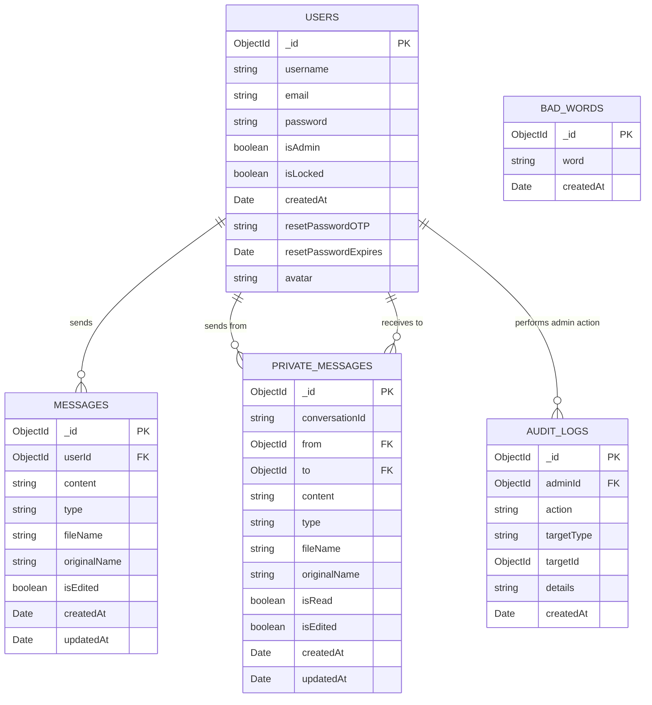

# BÁO CÁO DỰ ÁN
## ỨNG DỤNG CHAT THỜI GIAN THỰC (REAL-TIME CHAT APPLICATION)

---

## 1. TỔNG QUAN DỰ ÁN

### 1.1. Thông tin cơ bản
- **Tên dự án**: Real-time Chat Application
- **Loại ứng dụng**: Web Application
- **Mục đích**: Xây dựng ứng dụng chat thời gian thực với nhiều tính năng nâng cao
- **Công nghệ chính**: Node.js, Express.js, Socket.IO, MongoDB

### 1.2. Mục tiêu dự án
- Tạo ra một nền tảng chat trực tuyến hiện đại và đầy đủ tính năng
- Hỗ trợ giao tiếp nhóm và cá nhân
- Tích hợp AI chatbot để hỗ trợ người dùng
- Xây dựng hệ thống quản trị toàn diện
- Đảm bảo bảo mật và trải nghiệm người dùng tốt

---

## 2. PHÂN TÍCH YÊU CẦU

### 2.1. Yêu cầu chức năng
#### Người dùng thông thường:
- Đăng ký, đăng nhập tài khoản
- Gửi và nhận tin nhắn theo thời gian thực
- Chia sẻ file, hình ảnh, voice message
- Chat riêng tư 1-1
- Chat với AI bot
- Quản lý profile cá nhân
- Khôi phục mật khẩu qua email

#### Quản trị viên:
- Quản lý người dùng (khóa/mở khóa, xóa)
- Quản lý tin nhắn (xem, xóa)
- Lọc từ ngữ không phù hợp
- Xem thống kê hệ thống
- Theo dõi hoạt động qua audit log

### 2.2. Yêu cầu phi chức năng
- **Performance**: Xử lý tin nhắn real-time với độ trễ thấp
- **Scalability**: Hỗ trợ nhiều người dùng đồng thời
- **Security**: Mã hóa JWT, hash password, xác thực OTP
- **Usability**: Giao diện thân thiện, responsive design
- **Reliability**: Lưu trữ tin nhắn bền vững trong database

---

## 3. THIẾT KẾ HỆ THỐNG

### 3.1. Kiến trúc tổng thể
```
┌─────────────────┐    ┌─────────────────┐    ┌─────────────────┐
│   Frontend      │    │    Backend      │    │    Database     │
│   (HTML/JS/CSS) │◄──►│  (Node.js/      │◄──►│   (MongoDB)     │
│                 │    │   Express/      │    │                 │
│                 │    │   Socket.IO)    │    │                 │
└─────────────────┘    └─────────────────┘    └─────────────────┘
                              │
                              ▼
                       ┌─────────────────┐
                       │  External APIs  │
                       │  (Gmail SMTP,   │
                       │   Gemini AI)    │
                       └─────────────────┘
```

### 3.2. Cấu trúc thư mục dự án
```
Chat/
├── server.js              # Server chính
├── models/               # Các model MongoDB
│   ├── User.js          # Model người dùng
│   ├── Message.js       # Model tin nhắn công khai
│   ├── PrivateMessage.js # Model tin nhắn riêng tư
│   ├── BadWord.js       # Model từ cấm
│   └── AuditLog.js      # Model log hoạt động admin
├── routes/              # Các route API
│   ├── auth.js         # Xác thực & reset password
│   ├── messages.js     # Tin nhắn công khai
│   ├── private-messages.js # Tin nhắn riêng tư
│   ├── upload.js       # Upload file
│   ├── user.js         # Quản lý user
│   ├── admin.js        # Quản trị hệ thống
│   └── chatgpt.js      # AI chatbot
├── middleware/          # Middleware
│   ├── auth.js         # Xác thực JWT
│   └── upload.js       # Xử lý upload
├── utils/              # Tiện ích
│   └── mailer.js       # Gửi email OTP
└── public/             # Frontend files
    ├── css/           # Stylesheet
    ├── js/            # JavaScript
    ├── admin/         # Giao diện admin
    └── sounds/        # Âm thanh thông báo
```

### 3.3. Cơ sở dữ liệu

#### Entity Relationship Diagram (ERD):


#### Mô tả các collection chính:

1. **USERS**: Lưu thông tin người dùng
   - Chứa thông tin đăng nhập, quyền admin, trạng thái khóa
   - Hỗ trợ reset password với OTP
   - Lưu avatar người dùng

2. **MESSAGES**: Tin nhắn trong chat room chung
   - Liên kết với Users qua userId
   - Hỗ trợ nhiều loại content (text, image, file, voice)
   - Có khả năng chỉnh sửa tin nhắn

3. **PRIVATE_MESSAGES**: Tin nhắn riêng tư
   - Conversation giữa 2 users (from/to)
   - ConversationId để nhóm tin nhắn cùng cuộc hội thoại
   - Trạng thái đã đọc/chưa đọc

4. **BAD_WORDS**: Danh sách từ cấm
   - Quản lý bởi admin
   - Dùng cho auto-filter tin nhắn

5. **AUDIT_LOGS**: Log hoạt động quản trị
   - Theo dõi tất cả hành động của admin
   - Lưu chi tiết action và target object

---

## 4. CÔNG NGHỆ SỬ DỤNG

### 4.1. Backend
- **Node.js**: Runtime JavaScript cho server
- **Express.js**: Framework web cho Node.js
- **Socket.IO**: Thư viện real-time communication
- **MongoDB**: Cơ sở dữ liệu NoSQL
- **Mongoose**: ODM cho MongoDB
- **JWT**: Xác thực token
- **bcrypt**: Hash password
- **Multer**: Xử lý upload file
- **Nodemailer**: Gửi email

### 4.2. Frontend
- **HTML5**: Cấu trúc trang web
- **CSS3**: Styling và responsive design
- **JavaScript (ES6+)**: Logic frontend
- **Socket.IO Client**: Kết nối real-time với server

### 4.3. API tích hợp
- **Google Gemini AI**: Chatbot thông minh
- **Gmail SMTP**: Gửi email OTP reset password

---

## 5. TÍNH NĂNG CHI TIẾT

### 5.1. Hệ thống xác thực
- **Đăng ký/Đăng nhập**: JWT-based authentication
- **Quên mật khẩu**: Hệ thống OTP qua email với 3 bước:
  1. Nhập email → Gửi OTP 6 số
  2. Xác minh OTP (thời hạn 10 phút)
  3. Đặt lại mật khẩu mới

### 5.2. Chat công khai
- Tin nhắn real-time với Socket.IO
- Hỗ trợ text, emoji, hình ảnh, file, voice message
- Typing indicator
- Lọc từ ngữ không phù hợp tự động
- Xem danh sách user online
- Chỉnh sửa/xóa tin nhắn của bản thân

### 5.3. Chat riêng tư
- Nhắn tin 1-1 với bất kỳ user nào
- Hiển thị trạng thái online/offline
- Lưu trữ lịch sử hội thoại
- Gửi tin nhắn cho user offline (nhận khi online)
- Quản lý danh bạ recent contacts

### 5.4. AI Chatbot
- Tích hợp Google Gemini AI
- Chat với AI trong giao diện riêng biệt
- Hỗ trợ trả lời câu hỏi thông minh

### 5.5. Upload & Media
- Hỗ trợ nhiều định dạng file
- Tự động resize/compress hình ảnh
- Preview trước khi gửi
- Tải file với tên gốc (hỗ trợ tiếng Việt)

### 5.6. Admin Dashboard
- Quản lý người dùng (view, lock/unlock, delete)
- Quản lý tin nhắn (view, delete)
- Quản lý bad words filter
- Thống kê hệ thống (users, messages, hoạt động 24h)
- Audit log theo dõi hành động admin

---

## 6. KẾT QUẢ ĐẠT ĐƯỢC

### 6.1. Các tính năng hoàn thành
✅ Hệ thống chat real-time hoàn chỉnh  
✅ Xác thực người dùng an toàn  
✅ Chat riêng tư 1-1  
✅ AI chatbot integration  
✅ Upload đa phương tiện  
✅ Admin dashboard đầy đủ  
✅ Bad word filtering  
✅ Password reset với OTP  
✅ Responsive design  
✅ Voice messaging  

### 6.2. Metrics thành công
- **Real-time performance**: Độ trễ tin nhắn < 100ms
- **File upload**: Hỗ trợ file up to 10MB
- **Security**: JWT + bcrypt + OTP verification
- **User experience**: Modern UI/UX với dark mode
- **Admin tools**: Comprehensive management dashboard

---

## 7. HƯỚNG PHÁT TRIỂN

### 7.1. Tính năng có thể mở rộng
- **Video call**: Tích hợp WebRTC cho gọi video
- **Group chat**: Tạo nhóm chat riêng tư
- **Message reactions**: React emoji cho tin nhắn
- **Push notifications**: Thông báo trên desktop/mobile
- **Message search**: Tìm kiếm tin nhắn trong lịch sử
- **File sharing advanced**: Cloud storage integration
- **Multi-language**: Hỗ trợ đa ngôn ngữ

### 7.2. Cải tiến kỹ thuật
- **Microservices**: Tách các service riêng biệt
- **Redis**: Cache và session management
- **Load balancing**: Hỗ trợ scale horizontal
- **CDN**: Tối ưu delivery static files
- **Mobile app**: React Native/Flutter app

---

## 8. KẾT LUẬN

### 8.1. Đánh giá dự án
Dự án Real-time Chat Application đã được hoàn thành thành công với đầy đủ các tính năng cốt lõi của một ứng dụng chat hiện đại. Hệ thống có architecture tốt, code clean, và trải nghiệm người dùng mượt mà.

### 8.2. Kinh nghiệm rút ra
- **Socket.IO**: Rất mạnh mẽ cho real-time communication
- **MongoDB**: Phù hợp cho dữ liệu không có cấu trúc cố định
- **JWT Authentication**: Bảo mật tốt và stateless
- **Modular architecture**: Dễ maintain và extend
- **API integration**: Tích hợp AI và email service hiệu quả

### 8.3. Đóng góp của dự án
- Cung cấp một giải pháp chat hoàn chỉnh cho doanh nghiệp/cộng đồng
- Demonstate kiến thức full-stack development
- Tích hợp các công nghệ hiện đại (AI, real-time, cloud services)
- Áp dụng best practices về security và user experience

---

**Ngày hoàn thành**: [22-6-2025]  
**Phiên bản**: 1.0.0  
**Tác giả**: [Nguyễn Đình Viễn] 